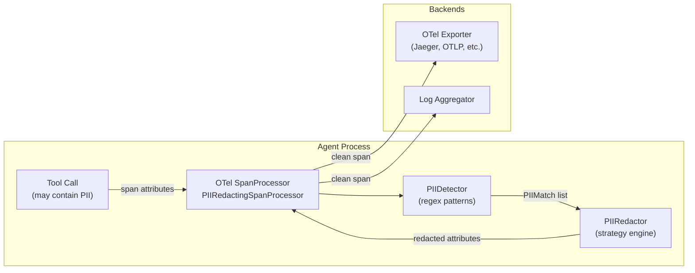

# aumai-pii-redactor

Automatic PII detection and redaction in agent telemetry.

[](https://github.com/aumai/aumai-pii-redactor/actions)
[](https://pypi.org/project/aumai-pii-redactor/)
[](LICENSE)
[](https://python.org)

---

## What is this?

When AI agents run, they produce a continuous stream of telemetry: spans, logs, tool
call inputs and outputs, LLM prompts and completions. This telemetry is invaluable for
debugging and observability — but it has a serious problem. Real user data flows through
agents, and that data frequently contains **personally identifiable information (PII)**:
email addresses, phone numbers, social security numbers, credit card numbers, IP
addresses.

If PII reaches your observability backend unfiltered, it becomes a data breach vector.
Compliance frameworks (GDPR, HIPAA, SOC 2) require that PII is not stored in logs
without explicit controls.

**aumai-pii-redactor** sits between your agent and your telemetry backend and
automatically scrubs PII before it leaves your process. Think of it as a bouncer at
the door of your observability pipeline: every span that wants to leave must have its
sensitive information removed first.

---

## Why does this matter?

### The invisible leak

Agent telemetry captures far more than developers expect. A single LLM tool call span
might contain:

- The user's query (which might include their SSN if they asked "what is my SSN
  ending in 1234?")
- The tool input (which could include a user's email from a lookup)
- The tool output (which might include a full user record)
- Intermediate reasoning steps that reference user data

None of this is logged intentionally — it is a byproduct of thorough observability.
But it is logged nonetheless, and standard OTel backends store it verbatim.

### Pattern-based detection is a pragmatic first line of defence

aumai-pii-redactor uses compiled regular expressions to detect common PII patterns.
This approach:

- Is **deterministic** — no ML model required, no external API calls
- Is **fast** — runs in microseconds per span
- Runs **in-process** — PII never leaves the machine before redaction
- Has **tunable confidence** — credit cards are validated against the Luhn algorithm
  to reduce false positives

It is not a perfect ML classifier — it will miss novel formats and may have false
positives. It is a pragmatic, deployable baseline that dramatically reduces PII
exposure with zero infrastructure dependencies.

---

## Architecture



---

## Features

| Feature | Description |
|---|---|
| **8 built-in PII types** | Email, phone, SSN, credit card, IPv4, IPv6, passport, date of birth |
| **Luhn validation** | Credit card confidence is boosted/penalised based on Luhn checksum |
| **4 redaction strategies** | `mask`, `hash`, `remove`, `replace` — configurable per PII type |
| **Custom regex patterns** | Add organisation-specific patterns via `RedactionConfig.custom_patterns` |
| **OTel SpanProcessor** | Drop-in `PIIRedactingSpanProcessor` for OpenTelemetry SDK |
| **Dict-level redaction** | Recursively redact all string values in nested dicts and lists |
| **Configurable rules** | Per-type overrides with `RedactionRule`; default strategy as fallback |
| **YAML or JSON config** | Load `RedactionConfig` from YAML or JSON files |
| **CLI** | `scan`, `redact`, `configure` commands |

---

## Quick Start

### Install

```bash
pip install aumai-pii-redactor
```

### Detect PII in a string

```python
from aumai_pii_redactor import PIIDetector, RedactionConfig

config = RedactionConfig()
detector = PIIDetector(config)

text = "Contact alice@example.com or call 555-123-4567 for support."
matches = detector.detect(text)

for match in matches:
    print(f"[{match.pii_type.value}] '{match.original_text}' "
          f"confidence={match.confidence:.2f}")
# [email] 'alice@example.com' confidence=0.99
# [phone] '555-123-4567' confidence=0.85
```

### Redact PII

```python
from aumai_pii_redactor import PIIRedactor, RedactionConfig

config = RedactionConfig()
redactor = PIIRedactor(config)

result = redactor.redact("SSN: 123-45-6789. Email: bob@corp.com")
print(result.redacted_text)
# SSN: 1***9. Email: b***m
print(f"Redacted {result.redactions_applied} items")
```

### Attach to OpenTelemetry

```python
from opentelemetry.sdk.trace import TracerProvider
from opentelemetry.sdk.trace.export import BatchSpanProcessor
from aumai_pii_redactor import PIIRedactingSpanProcessor, RedactionConfig

config = RedactionConfig()
provider = TracerProvider()
provider.add_span_processor(PIIRedactingSpanProcessor(config))
# Add your exporter after — it receives already-redacted spans
provider.add_span_processor(BatchSpanProcessor(your_exporter))
```

---

## CLI Reference

### `aumai-pii-redactor scan`

Scan a text file for PII and report all matches. Does not modify the file.

```
Usage: aumai-pii-redactor scan [OPTIONS]

  Scan a text file for PII and report all matches.

Required:
  --input PATH       Text file to scan.

Optional:
  --config PATH      Redaction config file (YAML or JSON).
  --json-output      Emit results as JSON array.
```

**Examples:**

```bash
# Human-readable output
aumai-pii-redactor scan --input ./agent-log.txt

# Machine-readable JSON (pipe to jq)
aumai-pii-redactor scan --input ./agent-log.txt --json-output | jq '.[].pii_type' | sort | uniq -c

# With custom config
aumai-pii-redactor scan --input ./log.txt --config ./rules.yaml
```

---

### `aumai-pii-redactor redact`

Redact PII from a text file and write the result to a new file.

```
Usage: aumai-pii-redactor redact [OPTIONS]

  Redact PII from a text file and write the result to a new file.

Required:
  --input PATH    Input text file.
  --output PATH   Output text file.

Optional:
  --config PATH                   Redaction config file.
  --strategy [mask|hash|remove|replace]
                                  Default strategy when no config supplied.
                                  [default: mask]
```

**Examples:**

```bash
# Mask everything (default)
aumai-pii-redactor redact --input ./raw-log.txt --output ./clean-log.txt

# Hash all PII (pseudonymisation)
aumai-pii-redactor redact \
  --input ./raw-log.txt \
  --output ./hashed-log.txt \
  --strategy hash

# Use per-type rules from config
aumai-pii-redactor redact \
  --input ./raw-log.txt \
  --output ./clean-log.txt \
  --config ./rules.yaml
```

---

### `aumai-pii-redactor configure`

Generate a default redaction config file with sensible rules for common PII types.

```
Usage: aumai-pii-redactor configure [OPTIONS]

  Generate a default redaction config file.

Optional:
  --output PATH    Path to write the config.  [default: rules.yaml]
```

```bash
# Generate YAML config (requires pyyaml)
aumai-pii-redactor configure --output ./rules.yaml

# Generate JSON config
aumai-pii-redactor configure --output ./rules.json
```

The generated config sets:

| PII Type | Strategy |
|---|---|
| `email` | `mask` |
| `phone` | `mask` |
| `ssn` | `replace` → `[SSN REDACTED]` |
| `credit_card` | `replace` → `[CARD REDACTED]` |
| `ip_address` | `hash` |

---

## Python API

### Detect PII

```python
from aumai_pii_redactor import PIIDetector, RedactionConfig

config = RedactionConfig()
detector = PIIDetector(config)

# Detect in a flat string
matches = detector.detect("alice@example.com called from 192.168.1.1")
for m in matches:
    print(f"{m.pii_type.value}: '{m.original_text}' @ {m.start}-{m.end}")

# Detect in a nested dict (returns dict of dotted-path -> matches)
data = {
    "user": {"email": "bob@corp.com", "ssn": "123-45-6789"},
    "tool_output": "Processed request from 10.0.0.1",
}
path_matches = detector.detect_in_dict(data)
for dotted_path, matches in path_matches.items():
    print(f"{dotted_path}: {[m.pii_type.value for m in matches]}")
```

### Redact with custom rules

```python
from aumai_pii_redactor import (
    PIIRedactor, PIIType, RedactionConfig, RedactionRule, RedactionStrategy,
)

config = RedactionConfig(
    default_strategy=RedactionStrategy.mask,
    rules=[
        # SSN gets a clear label instead of masking
        RedactionRule(
            pii_type=PIIType.ssn,
            strategy=RedactionStrategy.replace,
            replacement="[SSN REDACTED]",
        ),
        # Credit cards get completely removed
        RedactionRule(
            pii_type=PIIType.credit_card,
            strategy=RedactionStrategy.remove,
        ),
        # IPs get pseudonymised with a hash
        RedactionRule(
            pii_type=PIIType.ip_address,
            strategy=RedactionStrategy.hash,
        ),
    ],
)

redactor = PIIRedactor(config)
result = redactor.redact("SSN 123-45-6789, card 4111-1111-1111-1111, IP 10.0.0.1")
print(result.redacted_text)
# SSN [SSN REDACTED], card , IP 4a3b2c1d9e8f
```

### Redact a nested dict (e.g. OTel span attributes)

```python
from aumai_pii_redactor import PIIRedactor, RedactionConfig

config = RedactionConfig()
redactor = PIIRedactor(config)

span_attributes = {
    "user.email": "alice@example.com",
    "request.body": '{"ssn": "123-45-6789", "name": "Alice"}',
    "http.status_code": 200,  # Non-string values are left unchanged
}

clean_attributes = redactor.redact_dict(span_attributes)
print(clean_attributes)
# {
#   "user.email": "a***m",
#   "request.body": '{"ssn": "1***9", "name": "Alice"}',
#   "http.status_code": 200
# }
```

### Add custom PII patterns

```python
from aumai_pii_redactor import PIIDetector, PIIRedactor, RedactionConfig

config = RedactionConfig(
    custom_patterns={
        # Match internal employee IDs like EMP-12345
        "employee_id": r"\bEMP-\d{5}\b",
        # Match internal account codes like ACC-XXXXXXXX
        "account_code": r"\bACC-[A-Z0-9]{8}\b",
    },
    default_strategy="mask",
)

detector = PIIDetector(config)
matches = detector.detect("Employee EMP-12345 updated account ACC-AB12CD34.")
for m in matches:
    print(f"{m.pii_type.value}: '{m.original_text}'")
# custom: 'EMP-12345'
# custom: 'ACC-AB12CD34'
```

### OpenTelemetry span processor

```python
from opentelemetry.sdk.trace import TracerProvider
from opentelemetry.sdk.trace.export import BatchSpanProcessor
from opentelemetry.sdk.trace.export.in_memory_span_exporter import InMemorySpanExporter
from aumai_pii_redactor import PIIRedactingSpanProcessor, RedactionConfig

# Configure redaction rules
config = RedactionConfig(
    default_strategy="mask",
)

# Set up the provider with PII redaction BEFORE the exporting processor
exporter = InMemorySpanExporter()
provider = TracerProvider()
provider.add_span_processor(PIIRedactingSpanProcessor(config))
provider.add_span_processor(BatchSpanProcessor(exporter))

# Use the provider in your agent
tracer = provider.get_tracer("my-agent")
with tracer.start_as_current_span("tool-call") as span:
    span.set_attribute("user.email", "alice@example.com")
    span.set_attribute("request.id", "req-123")

# The exported span will have redacted attributes
finished = exporter.get_finished_spans()
print(finished[0].attributes["user.email"])  # 'a***m'
print(finished[0].attributes["request.id"])  # 'req-123' (not PII, unchanged)
```

---

## Configuration Options

### Redaction strategies

| Strategy | Behaviour | Example: `alice@corp.com` |
|---|---|---|
| `mask` | Keep first/last char, fill middle with `***` | `a***m` |
| `hash` | First 12 hex chars of SHA-256 digest | `3d4e5f6a7b8c` |
| `remove` | Replace with empty string | `` (empty) |
| `replace` | Replace with a fixed string (set `replacement` field) | `[EMAIL REDACTED]` |

### Configuration file format (YAML)

```yaml
default_strategy: mask

rules:
  - pii_type: email
    strategy: mask
  - pii_type: ssn
    strategy: replace
    replacement: "[SSN REDACTED]"
  - pii_type: credit_card
    strategy: replace
    replacement: "[CARD REDACTED]"
  - pii_type: ip_address
    strategy: hash

custom_patterns:
  employee_id: "\\bEMP-\\d{5}\\b"
```

### PII type confidence scores

| PII Type | Base Confidence | Notes |
|---|---|---|
| `email` | 0.99 | High — email format is unambiguous |
| `ip_address` (IPv4) | 0.95 | High — octet validation |
| `ip_address` (IPv6) | 0.98 | High |
| `ssn` | 0.90 | Invalid area/group/serial numbers excluded |
| `credit_card` | 0.90 base, +0.08 if Luhn-valid | Luhn check reduces false positives |
| `phone` | 0.85 | US formats + E.164 |
| `date_of_birth` | 0.80 | MM/DD/YYYY and MM-DD-YYYY |
| `passport` | 0.70 | Low — short regex; many false positives |
| `custom` | 0.80 | Fixed for all custom patterns |

---

## How It Works — Technical Deep Dive

### Detection pipeline

`PIIDetector.detect` applies all built-in patterns plus any custom patterns to the
input string. Patterns are ordered from most-specific to least-specific to minimise
overlap. Duplicate spans (same start/end positions) are deduplicated with a `set`.

Credit card numbers receive special treatment: after a regex match, the Luhn algorithm
is run over the digit sequence. Valid Luhn sequences get a +0.08 confidence boost;
invalid ones get a -0.30 penalty, reducing false positives from phone numbers and
similar digit strings.

### Redaction pipeline

`PIIRedactor.redact` calls `PIIDetector.detect`, then processes matches in **reverse
order** (rightmost span first). This ensures that replacing a span does not shift the
character positions of spans to its left. The result is a single-pass, O(n) redaction
over the string length.

### Dict traversal

`PIIDetector.detect_in_dict` and `PIIRedactor.redact_dict` both use a recursive
generator (`_flatten_dict`) that yields `(dotted_path, value)` pairs for every leaf
in a nested dict/list structure. Non-string leaves are passed through unchanged.

### OTel integration

`PIIRedactingSpanProcessor` implements the OTel `SpanProcessor` protocol. It is a
synchronous, no-op on `on_start` processor; all work is done in `on_end`. The
processor mutates span attributes in-place via the SDK's internal `_attributes` dict,
so that downstream exporters (added after this processor) receive clean data.

The processor does not require the OTel SDK as a hard dependency at import time — it
is only loaded if you import `PIIRedactingSpanProcessor` directly.

---

## Integration with Other AumAI Projects

- **aumai-modelseal** — Redact PII from model card metadata or evaluation datasets
  before signing with aumai-modelseal, ensuring the signed artifact contains no
  sensitive information.
- **aumai-chaos** — Use `PIIRedactor.redact_dict` on chaos experiment observations
  before persisting them, preventing any PII in component event details from leaking.
- **aumai-specs** — Define Pydantic contracts for span attribute schemas with
  aumai-specs; use aumai-pii-redactor to sanitise those attributes at runtime.

---

## Contributing

Contributions are welcome. See `CONTRIBUTING.md` for the full workflow.

- New built-in patterns must include test cases that cover true positives, false
  positives to avoid, and boundary conditions.
- All new code requires type annotations (mypy strict).
- Run `make lint test` before submitting a PR.

---

## License

Apache License 2.0. See [LICENSE](LICENSE) for full text.

Copyright 2024 AumAI Contributors.
